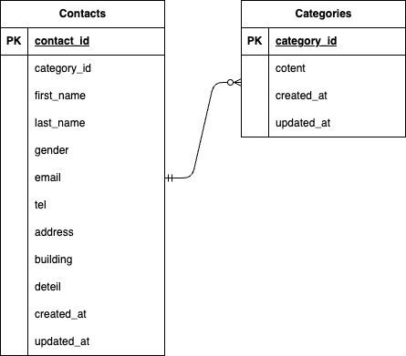

# お問い合わせフォーム

## 環境構築
Dockerビルト
1. git clone
2. docker-compose up -d --build

※MySQLは、OSによって起動しない場合があるので、それぞれのPCに合わせてdocker-compose.ymlファイルを編集してください。

Laravel環境構築
1. docker-compose exec php bash
2. composer install
3. .env.exampleファイルから.envを作成し、環境変数を変更
4. php artisan key:generate
5. php aritsan migrate
6. php aritsan db:seed

## 使用技術(実行環境)
- PHP ^7.3|^8.0
- Laravel 8.83.29
- MySQL 8.0.26

## ER図

## URL
- 開発環境：http://localhost/
- phpMyAdmin：http://localhost:8080/
